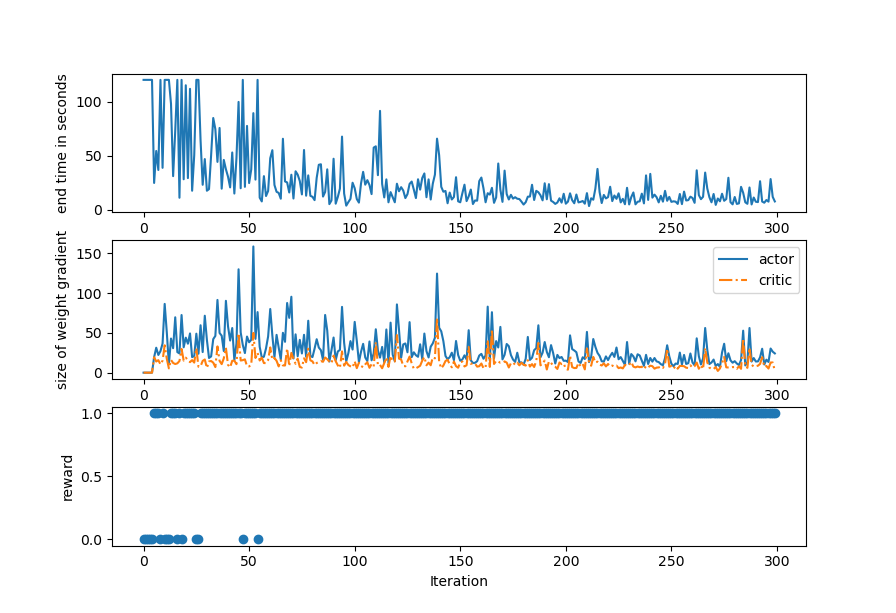
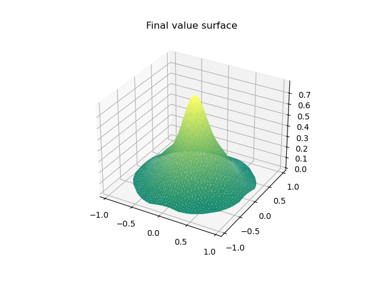
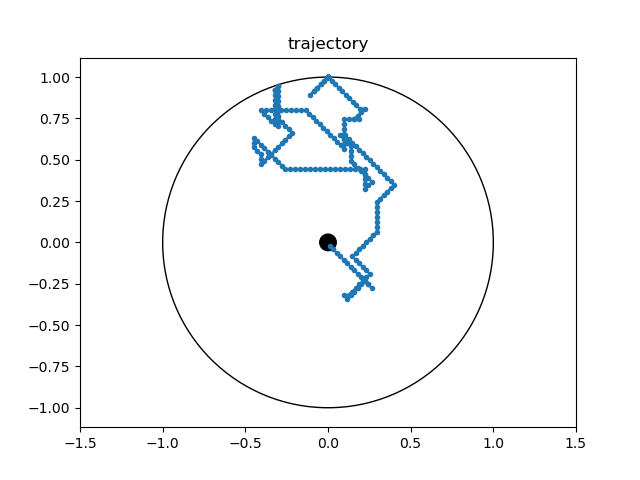
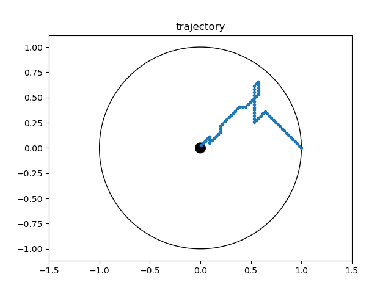

# Water Maze - Actor Critic Reinforcement Learning

An implementation of an actor critic reinforcement learning algorithm as described in Foster et al, 2000.

## Training performance

## Final value surface

## Example paths before and after training

## Development of value surface

Foster, D. J., Morris, R. G., & Dayan, P. (2000). A model of hippocampally dependent navigation, using the temporal difference learning rule. Hippocampus, 10(1), 1-16.
